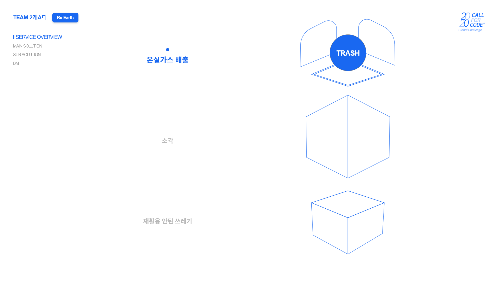
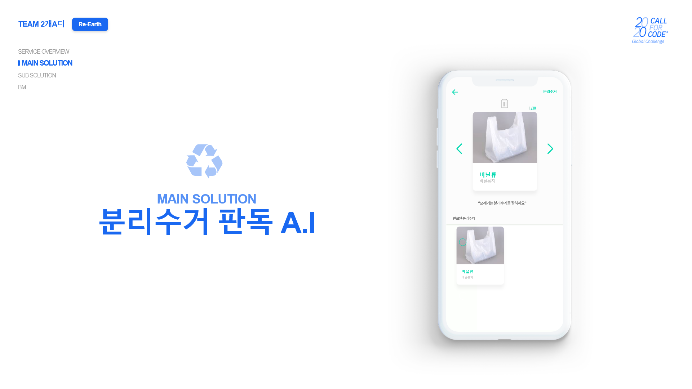
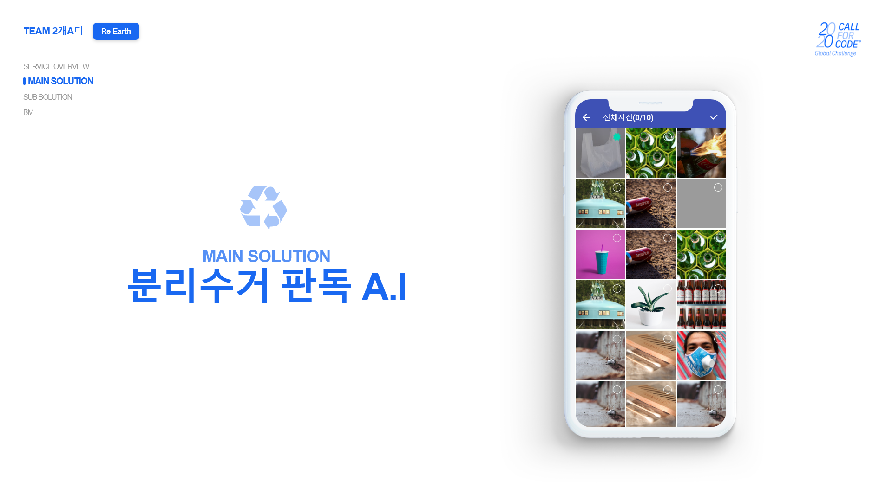
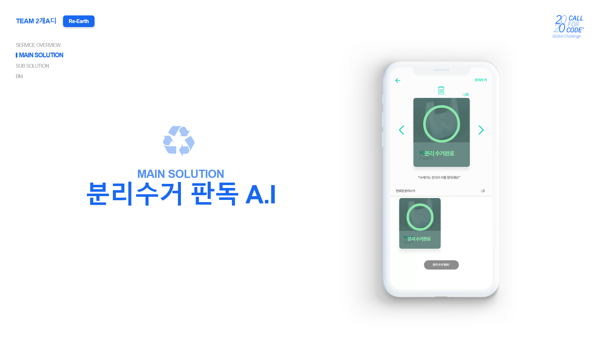
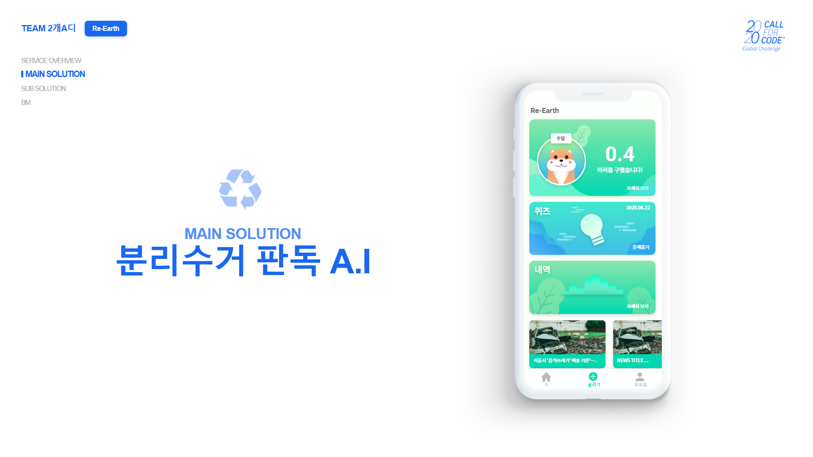
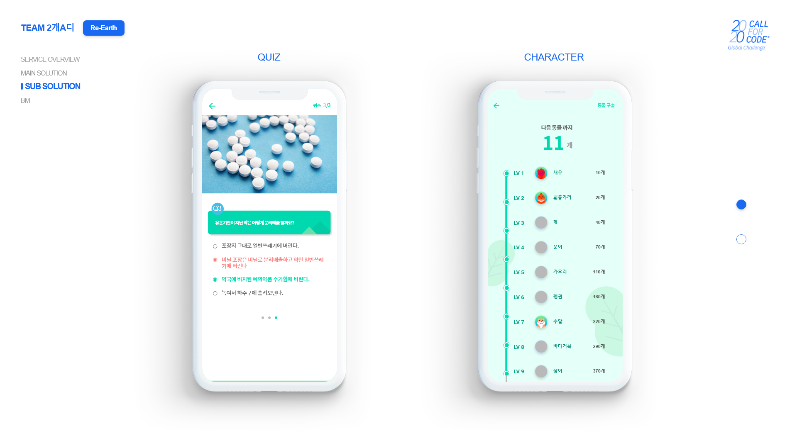
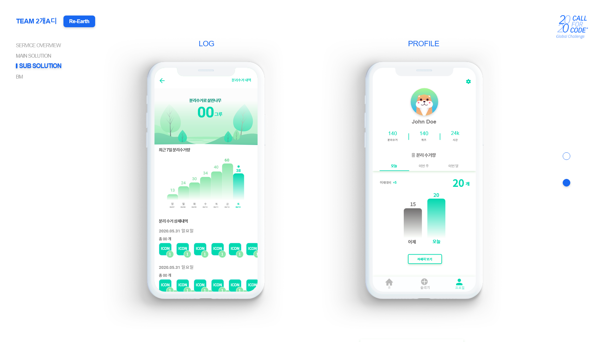

# Re-Earth

IBM 2020 Call For Code 해커톤에서 진행한 프로젝트입니다.

## 개요
환경오염을 보호하기 위해서는 어떤것이 가장 효과적일까요?  
분리수거 잘하기, 환경 미화원 늘리기 등.. 여러 솔루션이 있습니다.  
하지만 현재를 넘어 미래를 포함하면 답은 하나입니다.
###
	미래세대에게 분리수거 교육시키기
이것만큼 장기적으로 최상의 효과를 낼 수 있는 방법은 없다고 생각합니다.
그래서 우리는 분리수거 교육 앱을 개발하였습니다.

## 기술
- 앱
  > Flutter

## 구성원
- [오정민](https://github.com/owjs3901)(팀장)
- 김희연
- 이지헌
